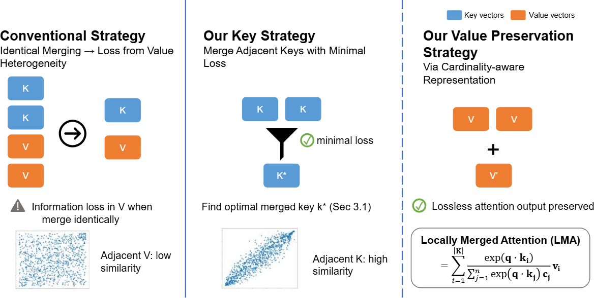

# AsymKV
This is the repository for [Homogeneous Keys, Heterogeneous Values: Exploiting Local KV Cache Asymmetry for Long-Context LLMs](https://arxiv.org/html/2506.05410v1),presented at NeurIPS 2025.

## 📋 Table of Contents

- [Overview](#overview)
- [Installation](#installation)
- [Quick Start](#quick-start)
- [Experiments](#experiments)
- [Acknowledgments](#acknowledgments)
- [Todo](#todo)

# Overview

Recent advances in Large Language Models (LLMs) have highlighted the critical importance of extending context length, yet the quadratic complexity of attention mechanisms poses significant challenges for efficient long-context modeling. KV cache compression has emerged as a key approach to address this challenge. Through extensive empirical analysis, we reveal a fundamental yet previously overlooked asymmetry in KV caches: while adjacent keys receive similar attention weights (local homogeneity), adjacent values demonstrate distinct heterogeneous distributions. This key-value asymmetry reveals a critical limitation in existing compression methods that treat keys and values uniformly. To address the limitation, we propose a training-free compression framework (AsymKV) that combines homogeneity-based key merging with a mathematically proven lossless value compression. Extensive experiments demonstrate that AsymKV consistently outperforms existing long-context methods across various tasks and base models. For example, on LLaMA3.1-8B, AsymKV achieves an average score of 43.95 on LongBench, surpassing SOTA methods like H2O (38.89) by a large margin.

# Installation
## Environment Setup
```bash
conda create -yn asymkv python=3.9
conda activate asymkv

pip install torch torchvision torchaudio
pip install transformers==4.33.0 accelerate datasets evaluate wandb scikit-learn scipy sentencepiece

cd AsymKV
pip install -e .
```
## Model Requirements
```json
{
    "Llama-2-7b-Chat" : "transformers==4.33.0",
    "Llama-3-8B-Instruct" : "transformers==4.33.0",
    "Llama-3.1-8B-Instruct" : "transformers==4.44.2",
    "Mistral-7B-Instruct-v0.3": "transformers==4.44.2",
    "Qwen2-7B-Instruct" : "transformers==4.44.2",
}
```
# Quick Start
```bash
python compress_forward.py --model NousResearch/Llama-3.1-8B-Instruct
```

# Experiments
## Observations of Local Key-Value Asymmetry
To reproduce the key observations presented in our paper, run the visualization notebook ([visual_asymkv.ipynb](visual_asymkv.ipynb)).

## LongBench
```bash
CUDA_VISIBLE_DEVICES=0,1,2,3,4,5,6,7 torchrun --nproc_per_node=8 --master_port 6656 pred.py --model Llama-3.1-8B-Instruct
```
# Acknowledgements
This repo is built upon the following projects:
- [LongBench](https://github.com/THUDM/LongBench/)
- [Streamingllm](https://github.com/mit-han-lab/streaming-llm)
- [Pyramidkv](https://github.com/Zefan-Cai/KVCache-Factory/)

# TODO
- [ ] Implement Triton-based FlashAttention kernel with AsymKV support